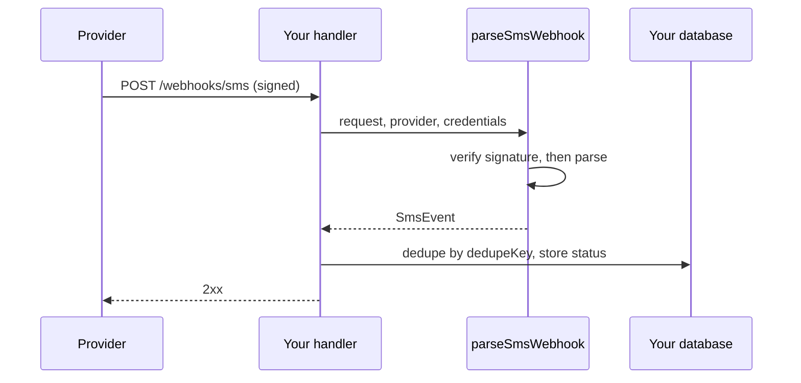

Providers report delivery status and incoming texts by calling a webhook on your server. Each provider has its own payload and signature. `parseSmsWebhook()` verifies the request and returns one `SmsEvent` shape for all four.

A successful `send()` only means the provider accepted the message. Whether it reached the phone arrives later as a status webhook. See [Delivery status webhooks](/receiving/delivery-status-webhooks).

## How it works

1. You set a webhook URL in the provider's console, or pass `webhookUrl` per message.
2. The provider calls that URL when a status changes or a message arrives.
3. Your handler passes the `Request`, provider name, and credentials to `parseSmsWebhook()`.
4. SMS SDK checks the signature over the raw body before reading any field.
5. You get an `SmsEvent`, or a `WebhookSignatureError` if the request is not authentic.



## A complete handler

```ts
import { parseSmsWebhook, WebhookSignatureError, type SmsEvent } from "@opencoredev/sms-sdk/webhooks";
import { db } from "./db";

export async function handleTelnyxWebhook(request: Request): Promise<Response> {
  let event: SmsEvent;
  try {
    event = await parseSmsWebhook({
      provider: "telnyx",
      request,
      credentials: { publicKey: process.env.TELNYX_PUBLIC_KEY ?? "" },
    });
  } catch (error) {
    if (error instanceof WebhookSignatureError) {
      return new Response("Invalid signature", { status: 401 });
    }
    throw error;
  }

  if (!(await db.webhookEvents.insertIfNew(event.dedupeKey))) {
    return new Response(null, { status: 200 }); // already handled
  }

  switch (event.type) {
    case "message.delivered":
    case "message.undelivered":
    case "message.filtered":
      await db.messages.updateStatus(event.providerId, event.type, event.errorCode);
      break;
    case "message.received":
      await db.inbox.save({ from: event.from, to: event.to, body: event.body, providerId: event.providerId });
      break;
    case "recipient.opted_out":
      await db.suppressions.add(event.from);
      break;
  }
  return new Response(null, { status: 200 });
}
```

The handler answers 401 to forged requests, acknowledges repeats without reprocessing them, and records the events it cares about. Framework versions are in [Next.js](/guides/nextjs) and [Hono and Bun](/guides/hono-and-bun).

## Event types

| `type` | When |
| --- | --- |
| `message.queued`, `message.sent`, `message.delivered`, `message.undelivered`, `message.filtered` | A status update for a message you sent. See [Delivery status webhooks](/receiving/delivery-status-webhooks). |
| `message.received` | Someone texted your number. See [Inbound SMS](/receiving/inbound-sms). |
| `recipient.opted_out`, `recipient.opted_in`, `recipient.help` | An inbound STOP, START, or HELP. See [STOP, HELP, and opt-outs](/receiving/stop-help-and-opt-outs). |
| `unrecognized` | A verified event SMS SDK does not map, such as a new status. `raw` holds the payload. |

Every event has `provider`, `dedupeKey`, and `raw`, plus `occurredAt` when the payload includes a time. The full shapes are in [Webhook events](/reference/webhook-events).

## Choose a page

| You want to | Page |
| --- | --- |
| Track delivery of sent messages | [Delivery status webhooks](/receiving/delivery-status-webhooks) |
| Read replies | [Inbound SMS](/receiving/inbound-sms) |
| Honor STOP and answer HELP | [STOP, HELP, and opt-outs](/receiving/stop-help-and-opt-outs) |
| Fix signature failures behind a proxy | [Webhook security](/receiving/webhook-security) |
| Handle repeats and out-of-order events | [Duplicates and ordering](/receiving/duplicates-and-ordering) |

## Best practices

- Verify every request. Never set `unsafeSkipVerification` outside tests. See [Webhook security](/receiving/webhook-security).
- Respond fast. Store the event and do slow work in a background job. Providers retry webhooks that time out, which creates duplicates.
- Deduplicate on `dedupeKey`, and do not trust order. A `message.sent` can arrive after `message.delivered`. See [Duplicates and ordering](/receiving/duplicates-and-ordering).
