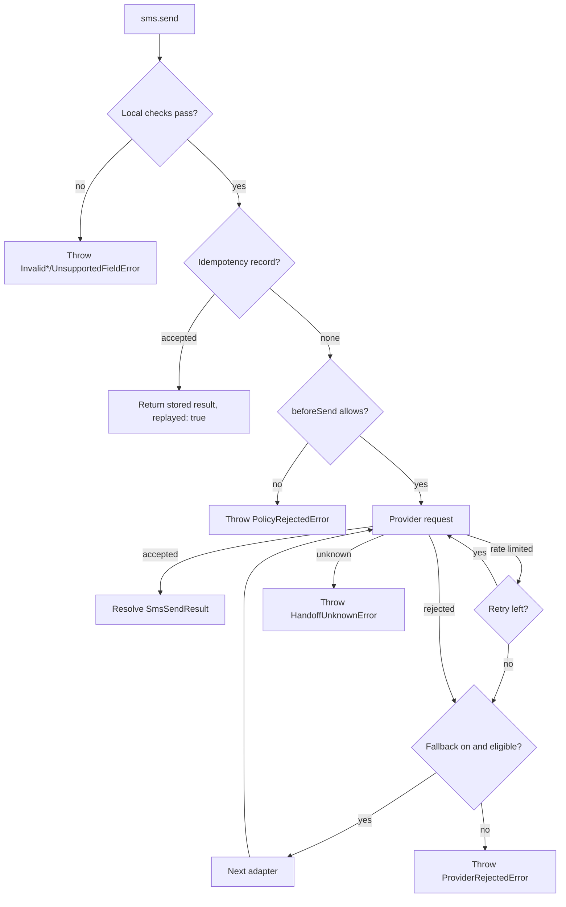

You want to send a message and know, without guessing, whether it went out. SMS SDK gives every send one of three outcomes and handles each one differently.

## Three outcomes

| Outcome | Meaning | What `send()` does |
| --- | --- | --- |
| Accepted | The provider created or queued the message. This is not handset delivery. | Resolves with an `SmsSendResult` (`handoff: "accepted"`). |
| Rejected | The provider proved it did not create the message: bad credentials, an unregistered sender, an invalid number, an opt-out. | Throws a `ProviderRejectedError` (or a subclass) with `retrySafe: true`. May fall back if you enabled it. |
| Unknown | The request may have reached the provider, and the response does not prove what happened: a timeout, a network error, a 5xx, a malformed success response. | Throws `HandoffUnknownError` with `retrySafe: false`. Never retries, never falls back. |

Delivery is a separate question. A later webhook tells you whether an accepted message was delivered, undelivered, or filtered. See [Delivery status webhooks](/receiving/delivery-status-webhooks).

## How a send runs

1. **Local checks.** The recipient must be E.164, the sender must be valid for the primary adapter, and every field you set must be supported. A failure throws before any network request. See [Validation and encoding](/sending/validation-and-encoding).
2. **Idempotency.** With a store and an `idempotencyKey`, an earlier accepted send is returned instead of sending again. See [Idempotency](/sending/idempotency).
3. **Policy.** Your `beforeSend` callback can block the message, for example for a suppressed recipient. See [Policy checks and hooks](/sending/policy-and-hooks).
4. **Requests.** The primary adapter sends. A documented rate limit is retried on the same adapter. A fallback-eligible rejection moves to the next adapter when `fallback: "on-known-rejection"` is set. See [Retries and fallback](/sending/retries-and-fallback).
5. **Result.** The first accepted response resolves the call. Anything else throws.

## Choose a page

| You want to | Page |
| --- | --- |
| Send a message and read the result | [Send your first SMS](/sending/send-your-first-sms) |
| Send from a short code, sender ID, or Messaging Service | [Senders and E.164 numbers](/sending/senders-and-e164) |
| Check a message before sending | [Validation and encoding](/sending/validation-and-encoding) |
| Estimate segments | [Segments and billing](/sending/segments-and-billing) |
| Send media, schedule, or set an expiry | [MMS, scheduling, and validity](/sending/mms-and-scheduling) |
| Add a second provider | [Retries and fallback](/sending/retries-and-fallback) |
| Avoid duplicate sends on retry | [Idempotency](/sending/idempotency) |
| Block suppressed recipients, log attempts | [Policy checks and hooks](/sending/policy-and-hooks) |

## Best practices

- **Pass an `idempotencyKey` for every message.** Make it describe the message, such as `order:123:shipped:v1`, not the attempt.
- **Treat `HandoffUnknownError` as "check first".** Look the message up in the provider console or wait for a status webhook before you send again.
- **Store `providerId`.** Status webhooks refer to the message by the provider's ID.
- **Keep fallback off until you need it.** When you turn it on, make sure the second provider has its own provisioned sender.
