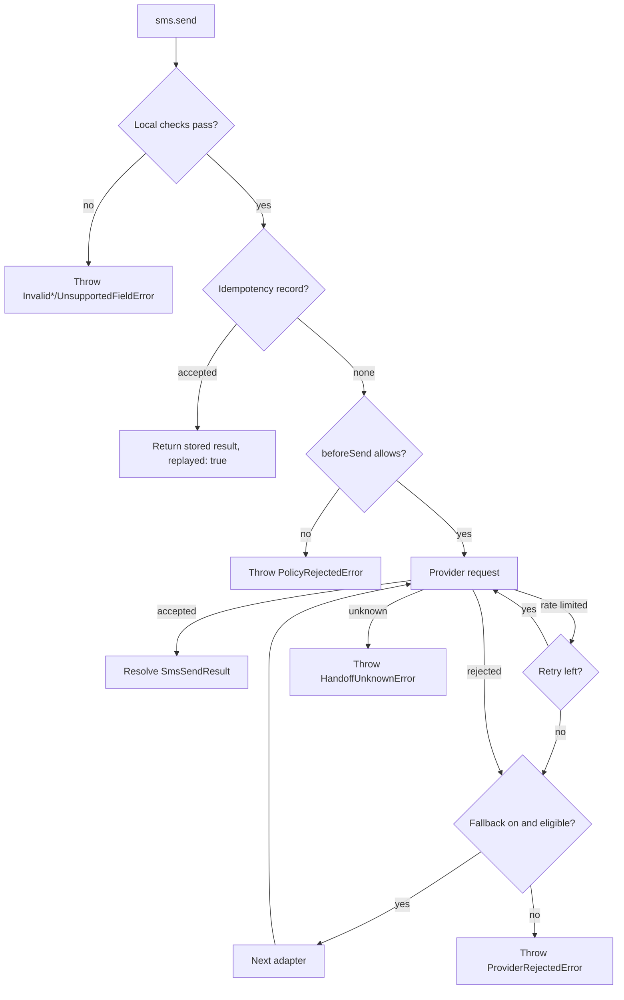

Every send ends in one of three outcomes, and SMS SDK handles each one differently.

## Three outcomes

| Outcome | Meaning | What `send()` does |
| --- | --- | --- |
| Accepted | The provider created or queued the message. This is not handset delivery. | Resolves with an `SmsSendResult` (`handoff: "accepted"`). |
| Rejected | The provider definitely did not create the message: bad credentials, an unregistered sender, an invalid number, an opt-out. | Throws `ProviderRejectedError` or a subclass, with `retrySafe: true`. Falls back if you enabled it. |
| Unknown | The request may have reached the provider, but the response does not show what happened: a timeout, a network error, a 5xx, a malformed success response. | Throws `HandoffUnknownError` with `retrySafe: false`. Never retries or falls back. |

Delivery is a separate question, answered later by a [status webhook](/receiving/delivery-status-webhooks).

## How a send runs

1. **Local checks.** The recipient must be E.164, the sender valid for the primary adapter, and every field supported. A failure throws before any network request. See [Validation and encoding](/sending/validation-and-encoding).
2. **Idempotency.** With a store and an `idempotencyKey`, an earlier accepted send is returned instead of sending again. See [Idempotency](/sending/idempotency).
3. **Policy.** Your `beforeSend` callback can block the message, for example for a suppressed recipient. See [Policy checks and hooks](/sending/policy-and-hooks).
4. **Requests.** The primary adapter sends. A documented rate limit is retried on the same adapter. With `fallback: "on-known-rejection"`, an eligible rejection moves to the next adapter. See [Retries and fallback](/sending/retries-and-fallback).
5. **Result.** The first accepted response resolves the call. Anything else throws.

## Choose a page

| You want to | Page |
| --- | --- |
| Send a message and read the result | [Send your first SMS](/sending/send-your-first-sms) |
| Send from a short code, sender ID, or Messaging Service | [Senders and E.164 numbers](/sending/senders-and-e164) |
| Check a message before sending | [Validation and encoding](/sending/validation-and-encoding) |
| Estimate segments | [Segments and billing](/sending/segments-and-billing) |
| Send media, schedule, or set an expiry | [MMS, scheduling, and validity](/sending/mms-and-scheduling) |
| Add a second provider | [Retries and fallback](/sending/retries-and-fallback) |
| Avoid duplicate sends on retry | [Idempotency](/sending/idempotency) |
| Block suppressed recipients, log attempts | [Policy checks and hooks](/sending/policy-and-hooks) |

## Best practices

- Pass an `idempotencyKey` for every message. It should name the message, such as `order:123:shipped:v1`, not the attempt.
- On `HandoffUnknownError`, check the provider console or wait for a status webhook before you send again.
- Store `providerId`. Status webhooks identify the message by it.
- Keep fallback off until you need it. When you turn it on, give the second provider its own provisioned sender.
